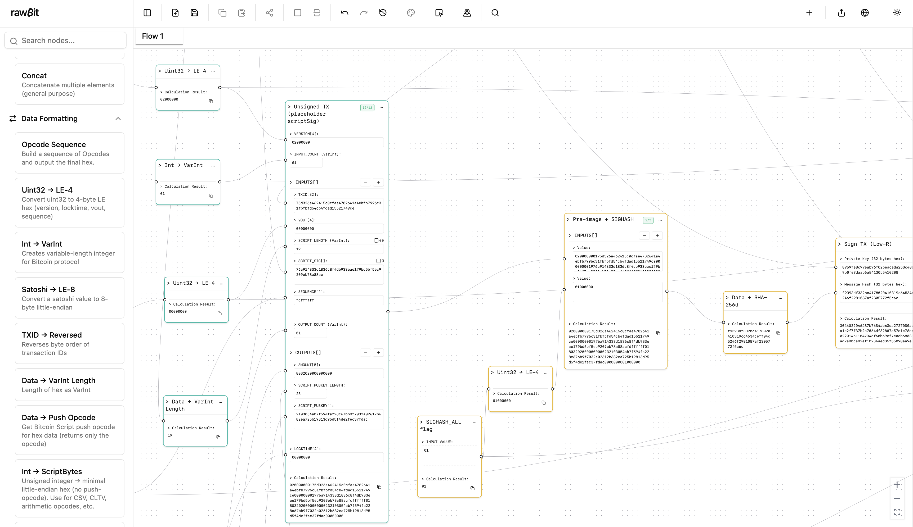

# rawBit

_rawBit is a visual, node-based editor for constructing and understanding Bitcoin transactions. Connect inputs, keys, and scripts on a canvas to build raw transactions visually._

**Try it now:** [rawbit.io](https://rawbit.io) | **Run locally:** See [Quick start](#quick-start-local) below

## Flow Examples

rawBit ships with **12 hands-on example lessons** you can load, tweak, and inspect. They progress from legacy to SegWit and Taproot, but each is standalone — start anywhere.

- **Lessons 1–2:** P2PKH, P2PK, multisig, and P2SH fundamentals
- **Lessons 3–4:** Timelocks (nLockTime / nSequence), CLTV/CSV patterns
- **Lessons 5–6:** OP_RETURN anchors, Spilman payment channel
- **Lesson 7:** Pre-SegWit malleability (why TXIDs changed)
- **Lesson 8:** SegWit P2WPKH (BIP143 preimage, witness)
- **Lesson 9:** SegWit P2WSH (multisig & conditional scripts)
- **Lesson 10:** Fee savings: wrapped SegWit vs legacy
- **Lesson 11:** Taproot key-path spend (P2TR, Schnorr)
- **Lesson 12:** Taproot script-path spend (taptree, control block, tapscript)

All example transactions were broadcast to **testnet3** and can be verified on explorers.

**Full lesson details:** [docu/l-sum.md](docu/l-sum.md)

## What you can do in 5 minutes

1. Load a **SegWit P2WSH** example from the templates sidebar (_Flow Examples_).
2. Tweak an input amount or locktime and watch the **preimage and witness data** update live.
3. Open a script node → **step through** opcodes and inspect the stack.
4. Copy a node’s **Python implementation** from the inspector to discuss/learn.

**More lessons coming:** Lightning HTLCs, Miniscript, CoinJoin, PSBT workflows, and covenant proposals.

---



---

## What is rawBit

- **Build raw Bitcoin transactions from scratch—no coding required:** Drag predefined nodes for keys, scripts, and math to build complete Bitcoin transactions.
- **Compare formats side-by-side:** P2PKH, P2SH-P2WPKH/P2WSH, native SegWit (v0), Taproot (v1).
- **See how serialization really changes:** Tweak `nSequence`, `nLockTime`, witness vs. non-witness data, and `SIGHASH` types and watch sizes, weight, TXID/WTXID update live.
- **Trust-but-verify artifacts:** Inspect and copy preimages, scripts, stack traces, weights, and fees; open any node to view the exact Python behind it.
- **Script debugger:** Step through script execution with stack diffs after each opcode to pinpoint **where** and **why** validation fails.
- **Share reproducible flows:** Export/share deterministic JSON so others can reproduce your bytes—not just stare at hex.

---

## Highlights

- **Visual canvas:** Drag, drop, and wire nodes to build flows.
- **Instant feedback:** Changes automatically trigger recalculation—see results update as you type.
- **Script debugger:** Step through a spend path and watch the stack mutate.
- **Undo/redo history:** Deep per-tab history (incl. script-debug steps).
- **Templates & clipboard:** Start from curated flows; copy/paste nodes, groups, and edge patterns.
- **Multi-tab workspace:** Independent flows with saved view transforms.
- **Networks:** Switch between testnet/mainnet/regtest.
- **Inspectable logic:** Each calculation node exposes the exact Python it runs.
- **Save/Load/Share:** Export flows as JSON, reload with fresh IDs, optionally share via a simple endpoint.
- **Themes:** Light/dark for long sessions.

---

## Who is this for?

Educators, auditors, and protocol-curious developers who want to understand Bitcoin transactions at the **byte and script** level.

### Non-goals

rawBit is **not** a wallet, broadcaster, or custody tool. Keep real funds out of it.

> ⚠️ **Educational use only.** rawBit can assemble mainnet-valid transactions, but you **should not** broadcast them or handle real funds with this tool. Use **testnet** or **regtest** for anything you intend to send.

---

## Prerequisites

- Node.js **18+**
- npm / pnpm / yarn
- Python **3.12+** with `pip` (backend depends on the forked `python-bitcointx`)
- C compiler toolchain + `libsecp256k1` headers (install via `brew install secp256k1`)

### macOS bootstrap (fresh machine)

```bash
# Compilers & headers
xcode-select --install

# Homebrew (installs under /opt/homebrew on Apple Silicon, /usr/local on Intel)
/bin/bash -c "$(curl -fsSL https://raw.githubusercontent.com/Homebrew/install/HEAD/install.sh)"
echo 'eval "$(/opt/homebrew/bin/brew shellenv)"' >> ~/.zprofile
eval "$(/opt/homebrew/bin/brew shellenv)"

# Runtime dependencies
brew install node@20 python@3.12 pkg-config secp256k1
```

> Replace `/opt/homebrew` with `/usr/local` on Intel Macs. After installation, run `source ~/.zprofile` (or open a new terminal) and verify `node --version`, `npm --version`, and `python3 --version`. If they still point at the system interpreters, append the following to `~/.zprofile` (swap `/opt/homebrew` for `/usr/local` on Intel machines) and reload it:
>
> ```bash
> echo 'eval "$(/opt/homebrew/bin/brew shellenv)"' >> ~/.zprofile
> echo 'export PATH="/opt/homebrew/bin:$PATH"' >> ~/.zprofile            # Homebrew userland
> echo 'export PATH="/opt/homebrew/opt/node@20/bin:$PATH"' >> ~/.zprofile # Node 20 is keg-only
> echo 'export PATH="/opt/homebrew/opt/python@3.12/libexec/bin:$PATH"' >> ~/.zprofile
> source ~/.zprofile
> ```
>
> Optional QoL: install [Oh My Zsh](https://ohmyz.sh/) for the branch-aware prompt:
>
> ```bash
> sh -c "$(curl -fsSL https://raw.githubusercontent.com/ohmyzsh/ohmyzsh/master/tools/install.sh)"
> ```

---

## Quick start (local)

```bash
# 1) Frontend
npm install
npx playwright install        # first run only: downloads browsers
npm run dev           # Vite dev server → http://localhost:3041/

# 2) Backend (new terminal)
python3 -m venv .myenv
source .myenv/bin/activate     # Windows: .myenv\Scripts\activate
pip install -r requirements.txt
pip install -r requirements-special.txt
python3 backend/routes.py       # Flask API → http://localhost:5007/
```

Open [http://localhost:3041/](http://localhost:3041/). The UI reads flows from `http://localhost:5007/flows` and sends calculations to `http://localhost:5007/bulk_calculate`.

> The backend uses a forked **python-bitcointx** pinned in `requirements-special.txt`. A virtualenv keeps those bindings isolated.

### Optional: environment tweaks

The repo ships with a default `.env` that targets the local backend. Override values by editing that file or creating `.env.local` (e.g., to point `VITE_API_BASE_URL` at a remote service).

---

## Installation (from source)

```bash
git clone https://github.com/rawBit-io/rawbit
cd rawbit

# Frontend
npm install

# Backend
python3 -m venv .myenv
source .myenv/bin/activate     # Windows: .myenv\Scripts\activate
pip install -r requirements.txt
pip install -r requirements-special.txt
```

---

## Architecture (at a glance)

- **Frontend:** React + Vite + Tailwind + `@xyflow/react`. Handles the canvas, tabs, panels, templates, clipboard, and per-tab undo/redo.
- **Backend:** Flask + Python (with `python-bitcointx`). Evaluates calculation nodes, validates scripts/signatures, enforces a sliding computation-time budget, and exposes `/bulk_calculate`, `/flows`, `/code`, and `/healthz`.

See `/docu` for the deeper tours:

- `frontend-architecture.md` – provider stack, hooks, canvas/panels/dialogs.
- `backend-overview.md` – calculation pipeline, budgets, and API surface.
- `api.md` – endpoints with request/response examples.

---

## Testing

```bash
# Frontend lint & unit/integration
npm run lint
npm run test

# Backend tests
source .myenv/bin/activate
pytest backend/tests

# MuSig2 BIP327 official vector suite
pytest backend/tests/test_musig2_bip327_vectors.py

# One command for everything (frontend + E2E + backend)
python3 run_all_tests.py        # add --e2e-browsers=all for FF/WebKit too
```

The MuSig2 backend path is validated against official BIP327 vectors and includes the
spec-mandated internal Sign self-check (`PartialSigVerifyInternal`).

---

## Roadmap (snapshot)

- Lightning basics
- CoinJoin basics
- Cross-chain swaps
- PSBT
- OP_CAT & covenant proposals
- Taproot intro

---

## Contributing

rawBit is a visual lab for Bitcoin transactions. The most useful contributions are **flows and lessons** that help others understand how things work.

### What we’re looking for

- **Working examples:** HTLCs, multisig, timelocks, fee comparisons
- **Debugging lessons:** “Why my P2WSH failed” (and the fix)
- **Proposal demos (experimental):** OP_CAT, CTV sketches

Keep flows small and focused on one concept.

### Code & bugs

Bug reports and fixes are welcome. We keep features minimal—changes should directly improve understanding or teaching of Bitcoin concepts.

---

## License

- **Code:** MIT (`LICENSE`)
- **Docs/tutorials:** CC BY 4.0 (`LICENSE-docs`)
